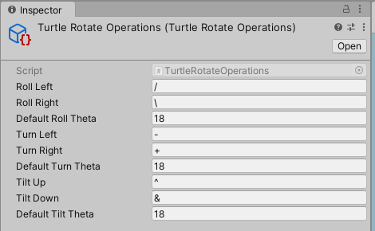
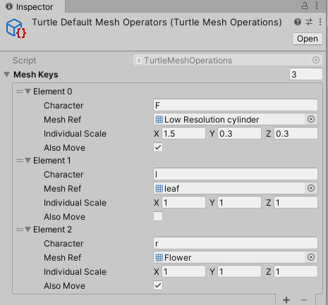
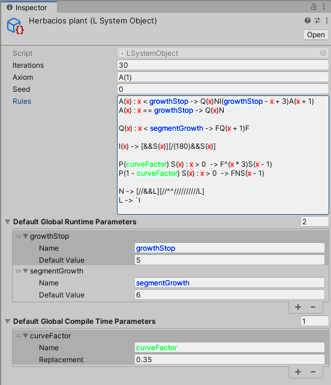

# com.dman.l-system 0.1.2

[](https://openupm.com/packages/com.dman.l-system/)

An attempt to implement most of the features present in L-systems described by ['The Algorithmic Beauty Of Plants'](http://algorithmicbotany.org/papers/abop/abop.pdf). If you are not familiar with L-Systems, read chapters 1.1, 1.2, 1.3, and 1.5 for the basics. Read 1.7 and 1.10 for details about stochastic and parametric rules, the behavior of rules in this implementation should mirror how they are described in those chapters with some [syntactical differences](#supported-rule-examples).

## Installation

Install via [openupm](https://openupm.com/) :

```
npm install -g openupm-cli
cd YOUR_UNITY_PROJECT_FOLDER
openupm add com.dman.l-system
```

To look at examples, clone the [source repo](https://github.com/dsmiller95/plantbuilder) and look in `Assets/Demo/PlantBuilder/LSystems` for the configuration.

## [Example Showcase](#example-showcase)

[Field Flower](https://github.com/dsmiller95/plantbuilder/blob/master/Assets/Demo/PlantBuilder/LSystems/Field%20flower.asset): from [The Algorithmic Beauty Of Plants, page 39](http://algorithmicbotany.org/papers/abop/abop.pdf#page=39)


[Herbaceous Plant](https://github.com/dsmiller95/plantbuilder/blob/master/Assets/Demo/PlantBuilder/LSystems/herbaceous%20plant.asset)


## [System Configuration](#system-configuration)

To build a new system from scratch, follow this template:

1. Create a new SystemDefinition scriptable object

   - Fill in the Axiom, rules, and iteration count, at least.

2. Create the turtle operations scriptable objects

   - Rotate Operations are used to define a set of characters which will turn, roll, or tilt the turtle
   - Mesh Operations are used to define the

3. Create a new GameObject in the scene to execute the l system

   - Add a Turtle Interpreter Behavior to the object
   - Drag your L System into the L System Behavior
   - Populate the Operation Sets list in the turtle interpreter with your defined turtle operation scriptable objects

4. Edit the L-System scriptable object during play mode. The system will automatically recompile every iteration, allowing for live editing.

## [Turtle Control](#turtle-control)

Turtle Operation scriptable objects are used to define how the Turtle interprets your L-System's output string.

### Rotate Operations

Rotate operations are used to turn, tilt, and roll the turtle. In essence these just apply euler rotations to the turtle, allowing it to turn in place. The Default Theta is the amount of turn to apply in degrees when the target symbol has no parameter. If the target symbol has one parameter defined, the turtle will instead rotate by that amount.

Example configuration:



For example, `++` will rotate the turtle right by 36 degrees. `^(30)/(10)` will tilt the turtle up by 30 degrees, then roll left by 10 degrees.

### Mesh Operations

Mesh operations are used to add elements to the output mesh, they are the only way to render output into the mesh. Since the Turtle's "forward" direction is always along the x-axis, the Meshes should align along that axis as well. The character is used to match the mesh to a character in the l-system string. The individual scale is a utility to scale the size of the mesh before it is added to the mesh, in the following example its used to make a cylinder of diameter 1 and depth 1 into a thinner, longer cylinder.

"Also Move" instructs the turtle to also change its position in addition to placing the mesh, based on the length of the mesh along the x-axis. If left unchecked, then the turtle will not advance forward and will place the mesh without moving at all.

"Parameter scale" is an option which will tell the turtle to scale the mesh by the "Scale Per Parameter" vector multiplied by the first parameter passed into the matching symbol. This can be used to simulate simple growth of plant components by just making them bigger based on something like their age

Example configuration:



In this example, F is used as the most basic stem unit. In the system this configuration is used in, no mesh elements build off of the end of leaves, so the Also Move checkbox has been left unchecked.

### Scale Operation

Defines a single character to be used to scale the turtle's current transformation. This will reduce the scale of everything done by the turtle, including the size of meshes as well as the distance traveled when translating the turtle.

## [Supported Rule Examples](#supported-rule-examples)

Currently this package has support for stochastic and parametric rules. A list of examples of the current and future grammar can be found in [rule-grammer](rule-grammer.txt). Not all of the examples in that file will work, consult the following list for what syntax is currently supported

Examples of currently valid rules:

Replaces `F` with `FF` every iteration:

```
F -> FF
```

---

Looks for `A` directly followed by `B`, and replaces both symbols with `B`

```
AB -> B
```

---

40% chance of replacing `F` with `FF`, and 60% chance to do nothing

```
P(0.4) F -> FF
P(1 - 0.4) F -> F
```

---

Replace `A` with itself, incrementing its only parameter by one

```
A(x) -> A(x + 1)
```

---

Replace `A` with other symbols, performing various maths on the parameters

```
A(x, y) -> B(y - x)A(x / y)
```

---

Replace `A` with itself, up until its parameter is at least 5. If starting with an axiom of `A(0)`, this rule will be applied 5 times

```
A(age) : age < 5 -> A(age + 1)
```

---

## [Extension](#extension)

The turtle interpreter is set up to be extensible. If you want to build your own operations on the currently available turtle state parameters, implement the `TurtleOperationSet<TurtleState>` abstract class, and create an instance of your new scriptable object. I recommend looking at [TurtleScaleOperations](Runtime/TurtleScaleOperations.cs) as the simplest example of an implementation.

If you need additional properties in the turtle state, you should re-implement the [TurtleInterpreterBehavior](Runtime/TurtleInterpreterBehavior.cs), using a different generic parameter for the TurtleInterpreter instance, and define your own set of turtle operators to operate on your new state struct.

## [Parameterization](#parameterization)

Parameters for each rule can be defined in three ways: as Rule-specific Parameters, as Global Runtime Parameters, and as Global Compile Time Parameters.

### Runtime parameters

Rule-specific Parameters are the symbols between parentheses on the left hand side of the rule declaration. Each rule will not match against a string unless the symbol has the exact number of parameters as defined in the rule matcher. For example, `A(x, y) -> B(x)` will match against `A(1, 2)`, but not against `A(4)`, `A(4, 2, 1)`, or `A`.

The Global Runtime Parameters are passed in every time the L-System steps, and can be used in all the same contexts that Rule-specific Parameters can be used. The only difference is that they are not part of the rule's matching pattern. These can be used to pass information into the system that will change as the system grows.

### Compile time parameters

Global Compile Time Parameters should be used to pass in parameters that will not change throughout the whole life of the L-system, and function similarly to [C++ #define directives](http://www.cplusplus.com/doc/tutorial/preprocessor/). Compile time parameters are ideal to modify the stochastic probability of rules, the following example uses them in this way. No other parameters can be used in the probability expression, since the probability must be known at compile-time.

Since these are simple string replacements, they could also be used to modify the structure and behavior of the system! They could define new replacement patterns or even whole rules which get placed into the system at compile time.

### Example

Example of each parameter type defined in an L-System object editor. Coloring has beed added to indicate the parameter type: Rule-specific Parameters are red, Global Runtime Parameters are blue, and Global Compile Time Parameters are green.



### Supported expression operations

These are the operators you can use inside expressions to evaluate parameter values between parentheses, in order of precedence. When not specified, they function the same as their C# counterparts.

```
Unary operators:
-x, !x

Math operators:
x * y, x / y, x % y
x ^ y Exponent
x + y, x - y

Comparisons:
x > y, x < y, x >= y, x <= y
x == y, x != y

Boolean logic:
x && y
x || y
```

## [Limitations](#limitations)

- Does not support contextual matches, E.X. `C < A > B -> X`
