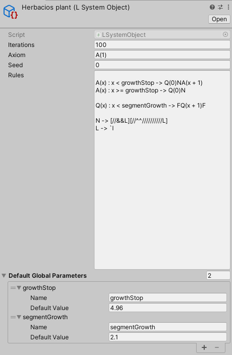

# L-System 0.1

[](https://openupm.com/packages/com.dman.l-system/)

An attempt to implement most of the features present in L-systems described by 'The Algorithmic Beauty Of Plants' http://algorithmicbotany.org/papers/abop/abop.pdf

For examples of usage, look at the source project in this folder: https://github.com/dsmiller95/plantbuilder/tree/master/Assets/Demo/PlantBuilder/LSystems

## Field Flower


## System Configuration

To build a new system from scratch, follow this template:

1. Create a new SystemDefinition scriptable object

   - Fill in the Axiom, rules, and iteration count, at least.

2. Create the turtle operations scriptable objects

   - Rotate Operations are used to define a set of characters which will turn, roll, or tilt the turtle
   - Mesh Operations are used to define the

3. Create a new GameObject in the scene to execute the l system

   - Add a Turtle Interpreter Behavior to the object
   - Drag your L System into the L System Behavior
   - Populate the Operation Sets list in the turtle interpreter with your defined turtle operation scriptable objects

4. Edit the L-System scriptable object during play mode. The system will automatically recompile every iteration, allowing for live editing.

## Turtle Control

Turtle Operation scriptable objects are used to define how the Turtle interprets your L-System's output string

### Rotate Operations

Rotate operations are used to turn, tilt, and roll the turtle. In essence these just apply euler rotations to the turtle, allowing it to turn in place. The Default Theta is the amount of turn to apply in degrees when the target symbol has no parameter. If the target symbol has one parameter defined, the turtle will instead rotate by that amount.

Example configuration:


For example, `++` will rotate the turtle right by 36 degrees. `^(30)/(10)` will tilt the turtle up by 30 degrees, then roll left by 10 degrees.

### Mesh Operations

Mesh operations are used to add elements to the output mesh, they are the only way to render output into the mesh. Since the Turtle's "forward" direction is always along the x-axis, the Meshes should align along that axis as well. The character is used to match the mesh to a character in the l-system string. The individual scale is a utility to scale the size of the mesh before it is added to the mesh, in the following example its used to make a cylinder of diameter 1 and depth 1 into a thinner, longer cylinder.

"Also Move" instructs the turtle to also change its position in addition to placing the mesh, based on the length of the mesh along the x-axis. If left unchecked, then the turtle will not advance forward and will place the mesh without moving at all.

Example configuration:


In this example, F is used as the most basic stem unit. In the system this configuration is used in, no mesh elements build off of the end of leaves, so the Also Move checkbox has been left unchecked.

### Scale Operation

Defines a single character to be used to scale the turtle's current transformation. This will reduce the scale of everything done by the turtle, including the size of meshes as well as the distance traveled when translating the turtle.

## Supported Rule Examples

Currently this package has support for stochastic and parametric rules. A list of examples of the current and future grammar can be found in [rule-grammer](rule-grammer.txt). Not all of the examples in that file will work, consult the following list for what syntax is currently supported

Examples of currently valid rules:

Replaces `F` with `FF` every iteration:

```
F -> FF
```

---

Looks for `A` directly followed by `B`, and replaces both symbols with `B`

```
AB -> B
```

---

40% chance of replacing `F` with `FF`, and 60% chance to do nothing

```
(P0.4) F -> FF
(P0.6) F -> F
```

---

Replace `A` with itself, incrementing its only parameter by one

```
A(x) -> A(x + 1)
```

---

Replace `A` with other symbols, performing various maths on the parameters

```
A(x, y) -> B(y - x)A(x / y)
```

---

Replace `A` with itself, up until its parameter is at least 5. If starting with an axiom of `A(0)`, this rule will be applied 5 times

```
A(age) : age < 5 -> A(age + 1)
```

---

## Extension

The turtle interpreter is set up to be extensible. If you want to build your own operations on the currently available turtle state parameters, implement the `TurtleOperationSet<TurtleState>` abstract class, and create an instance of your new scriptable object. I recommend looking at [TurtleScaleOperations](Runtime/TurtleScaleOperations.cs) as the simplest example of an implementation.

If you need additional properties in the turtle state, you should re-implement the [TurtleInterpreterBehavior](Runtime/TurtleInterpreterBehavior.cs), using a different generic parameter for the TurtleInterpreter instance, and define your own set of turtle operators to operate on your new state struct.

## Parameterization

Parameters for each rule can be defined in two places. All of the strings captured between the parenthesis in the left hand side of the rule will be treated as parameters, and that rule will not match unless the matching symbol has the exact number of parameters as defined in that section. In addition, the L-system will allow for global parameters to be named and defined. The global parameters can be used in the replacement rules and conditionals of every rule of that L-system as if they were a matched parameter.

Example of a valid L-System using global parameters:



### Supported expression operations

Default operations, same as their definition in C#:

```
x + y, x - y, x * y, x / y, x % y
x > y, x < y, x >= y, x <= y, x == y, x != y
x && y, x || y
```

Unary operations: `-x, !x`

And an exponent operator: `x^y`

This is a list of all operators, in groups based on operator precedence. The order of operations is exactly the same as in the C# language, with the exception of the new exponent operator. The first items in the list are evaluated first.

```
-x, !x
x*y, x/y, x%y
x^y
x+y, x-y
x>y, x<y, x>=y, x<=y
x==y, x!=y
x&&y
x||y

```

## Limitations

- Does not support contextual matches, E.X. `C < A > B -> X`
- Stochastic probability cannot be parameterized
