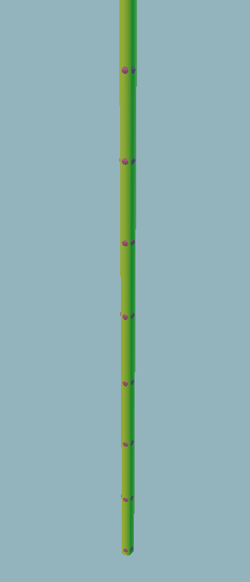
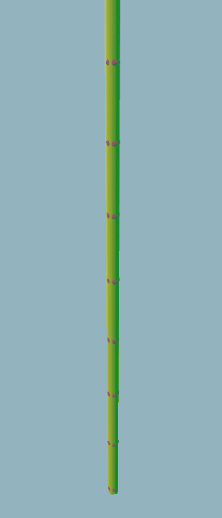
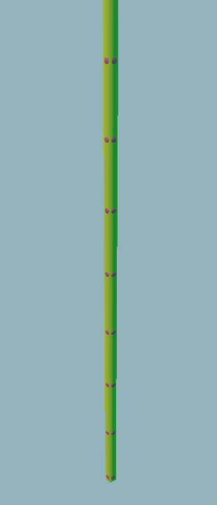
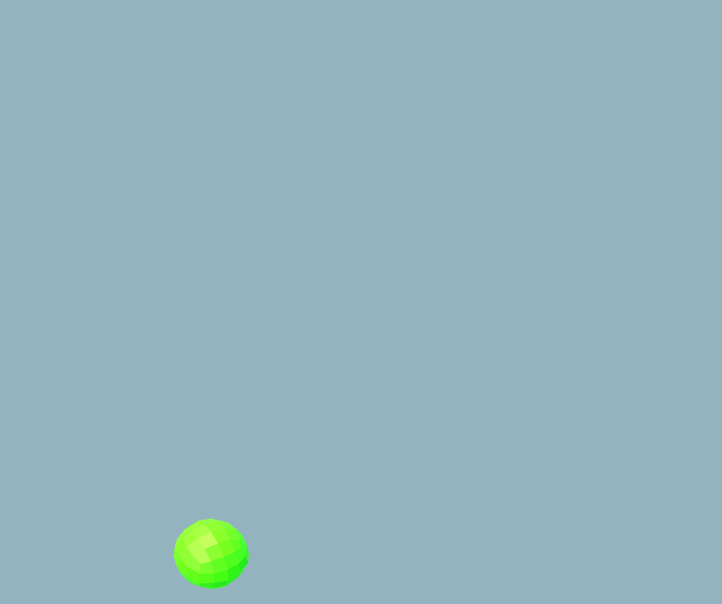

# L System

[](https://openupm.com/packages/com.dman.l-system/)

An attempt to implement most of the features present in L-systems described by ['The Algorithmic Beauty Of Plants'](http://algorithmicbotany.org/papers/abop/abop.pdf). If you are not familiar with L-Systems, read chapters 1.1, 1.2, 1.3, and 1.5 for the basics. Read 1.7 and 1.10 for details about stochastic and parametric rules, the behavior of rules in this implementation should mirror how they are described in those chapters with some [syntactical differences](#rule-examples).

- [Installation](#installation)
- [System configuration](#system-configuration)
  - [Turtle interpretation](#turtle-control)
  - [Extension](#extension)
- [L-System Language](#l-system-language)
  - [Rule examples](#rule-examples)
  - [Parameterization](#parameterization)
  - [Contextual Matching](#contextual-matching)
  - [Library Files](#library-files)
  - [Predefined libraries](#predefined-libraries)
    - [Diffusion](#diffusion)
    - [Identity](#organ-identity)
    - [Sunlight](#sunlight)
    - [Autophagy](#autophagy)
    - [Extra vertex data](#extra-vertex-data)
- [Contributing](#contributing)
- [Examples](#example-showcase)

## [Installation](#installation)

Install via [openupm](https://openupm.com/) :

```
npm install -g openupm-cli
cd YOUR_UNITY_PROJECT_FOLDER
openupm add com.dman.l-system
```

To look at examples, clone the [source repo](https://github.com/dsmiller95/plantbuilder) and look in `Assets/PlantBuilder/LSystems` for the configuration.

# [System Configuration](#system-configuration)

To build a new system from scratch, follow this template:

1. Create a new .lsystem text file

   - Fill in the `#axiom`, `#iteration`, and some list of rules

2. Create the [turtle operations scriptable objects](#turtle-control)

3. Create a new GameObject in the scene to execute the l system

   - Add a Turtle Interpreter Behavior to the object
   - Drag your L System into the L System Behavior
   - Populate the Operation Sets list in the turtle interpreter with your defined turtle operation scriptable objects
   - When running, call Compile on the l-system asset, and call the StepSystem method on the LSystemBehavior to step the system forward

## [Turtle Control](#turtle-control)

Turtle Operation scriptable objects are used to define how the Turtle interprets your L-System's output string.

### Rotate Operations

Rotate operations are used to turn, tilt, and roll the turtle, and imitate the behavior defined in (page 19 of Algorithmic Beauty of Plants)[http://algorithmicbotany.org/papers/abop/abop.pdf#page=31]. In essence these just apply euler rotations to the turtle, allowing it to turn in place. The Default Theta is the amount of turn to apply in degrees when the target symbol has no parameter. If the target symbol has one parameter defined, the turtle will instead rotate by that amount.

Example configuration:


For example, `++` will rotate the turtle right by 36 degrees. `^(30)/(10)` will tilt the turtle up by 30 degrees, then roll left by 10 degrees.

### Mesh Operations

Mesh operations are used to add elements to the output mesh, they are the only way to render output into the mesh. Since the Turtle's "forward" direction is always along the x-axis, the Meshes should align along that axis as well. The character is used to match the mesh to a character in the l-system string. The individual scale is a utility to scale the size of the mesh before it is added to the mesh, in the following example its used to make a cylinder of diameter 1 and depth 1 into a thinner, longer cylinder.

"Also Move" instructs the turtle to also change its position in addition to placing the mesh, based on the length of the mesh along the x-axis. If left unchecked, then the turtle will not advance forward and will place the mesh without moving at all.

"Parameter scale" is an option which will tell the turtle to scale the mesh by the "Scale Per Parameter" vector multiplied by the first parameter passed into the matching symbol. This can be used to simulate simple growth of plant components by just making them bigger based on something like their age

Example configuration:


In this example, `F` is used as the most basic stem unit. In the [herbaceous plant](https://github.com/dsmiller95/plantbuilder/blob/master/Assets/PlantBuilder/LSystems/herbaceous-plant.lsystem) system, no mesh elements build off of the end of leaves, so the Also Move checkbox has been left unchecked.

### Scale Operation

Defines one character to be used to scale the turtle's current transformation. This will multiply the scale of everything done by the turtle, such as the size of meshes and as the distance traveled when translating the turtle. The character can also be parameterized in three ways:`!` will scale by the default configured scale in the scriptable object, `!(x)` will scale every dimension by x exactly, and `!(x, y, z)` will scale by the vector <x, y, z>

Also defines a thickness scaling operator, `@`. works similarly to the vector based scaling operator, but instead multiplies a scalar value which tracks "thickness". The thickness value is applied to mesh's which have UseThickness checked, and will scale the mesh along the non-primary axises (y and z). Pretty useful for controlling the thickness of stems and trunks. Can pass in a single parameter to override the default multiplier.

### Bend Operation

Bends the turtle toward a given world-space vector, scaled by the magnitude of the cross-product between the current turtle's heading and the world-space vector. This operation replicates the function of the Tropism Vector described on [page 58 of Algorithmic Beauty of Plants](http://algorithmicbotany.org/papers/abop/abop.pdf#page=70). See it in use in the [fruiting plant L-system](https://github.com/dsmiller95/plantbuilder/blob/master/Assets/PlantBuilder/LSystems/fruiting-plant.lsystem), in this case different plant organs have different bending factors which can be used to represent the stiffness of that organ.

# [L System Language](#l-system-language)

`.lsystem` files are interpreted on a line-by-line bases. Each line is interpreted in one of 3 ways: lines starting with `##` are comments, lines starting with `#` are directives, and all other non-empty lines are parsed as Rules.

There are 9 types of directives. parameters to the directives are parsed based on space separation:

- `#axiom <string>` defines the axiom for this system
- `#iterations <int>` defines how many iterations the system should step for, by default. x must be an integer.
- `#matches <string>` sets every symbol in the string to be included in when evaluating contextual matches defined in this file. Every symbol not in this set will be treated as if it was not part of the l-system string when matching. Can be declared multiple times
- `#symbols <symbols>` required to define character symbols which are used as part of this file. Must include every symbol used by the system, including those declared in `#global`, `#include`, and `#export` directives. The symbols can be spread across several directives, and all `<symbols>` declared in the file will be combined together into one set for the file
- `#runtime <string> <float>` defines a global runtime value named <string> with a default value of <float>
  - The identifier used must be globally unique when using `.lsyslib` files. It is suggested to scope global variables defined in library files by the name of the library file, for EX (`std:growthRate`). Scoping does nothing special, it's just an easy way to avoid collisions when using multiple files
- `#define <string> <string>` defines a global compile time replacement directive which searches the full text of the rules for an exact match against the first string, replacing with the second string.
  - The same globally unique restrictions apply to `#define` variables as apply to `#runtime` variables
- `#global <string>` defines a set of symbols in the "global" scope which this file will use. Only relevant when using `.lsyslib` files, see [Library files](#library-files)
- `#include <relative path> [<symbol remapping>]` used to import another set of rules into this system, with some or none import remappings to allow this system to interact with the symbols in that file. See [Library files](#library-files)
- `#export <name> <symbol>` only usable in `.lsyslib` files. Export a specific symbol with a name, allowing it to be imported by other system files.

## [Rule Examples](#rule-examples)

Currently this package has support for stochastic, parametric, and contextual Rules. A list of examples of the current and future grammar can be found in [rule-grammar](rule-grammar.txt). Not all of the examples in that file will work, consult the following list and the [Examples](#example-showcase) for currently supported syntax.

When multiple rules are defined on the same root symbol, they are evaluated in a specific order, and the first match is used. The rules with the largest contextual matching phrases will be checked first. When the contextual matching phrases are the same size the ordering in the system file is used: The rules earlier in the file will be checked first.

Examples of currently valid rules:

<details>
   <summary>Click to expand</summary>

Replaces `F` with `FF` every iteration:

```
F -> FF
```

---

Looks for `A` with a child of `B`, and replaces self with `B`

```
A > B -> B
```

---

40% chance of replacing `F` with `FF`, and 60% chance to do nothing

```
P(0.4) | F -> FF
P(1 - 0.4) | F -> F
```

---

Replace `A` with itself, incrementing its only parameter by one

```
A(x) -> A(x + 1)
```

---

Replace `A` with other symbols, performing various maths on the parameters

```
A(x, y) -> B(y - x)A(x / y)
```

---

Replace `A` with itself, up until its parameter is at least 5. If starting with an axiom of `A(0)`, this rule will be applied 5 times

```
A(age) : age < 5 -> A(age + 1)
```

---

</details>

## [Parameterization](#parameterization)

Parameters for each rule can be defined in three ways: as Rule-specific Parameters, as Global Runtime Parameters, and as Global Compile Time Parameters.

### Runtime parameters

Rule-specific Parameters are the symbols between parentheses on the left hand side of the rule declaration. Each rule will not match against a string unless the symbol has the exact number of parameters as defined in the rule matcher. For example, `A(x, y) -> B(x)` will match against `A(1, 2)`, but not against `A(4)`, `A(4, 2, 1)`, or `A`.

The Global Runtime Parameters are passed in every time the L-System steps, and can be used in all the same contexts that Rule-specific Parameters can be used. They are defined in the `.lsystem` file with the `#runtime` directive, and can be changed by name in the L-System Behavior object between system steps.

### Compile time parameters

Global Compile Time Parameters should be used to define in parameters that will not change throughout the whole life of the L-system, and function similarly to [C++ #define directives](http://www.cplusplus.com/doc/tutorial/preprocessor/), and are defined similarly: `#define branchProbabilityFactor 0.2`. Compile time parameters are ideal to modify the stochastic probability of rules, [herbaceous-plant.lsystem](https://github.com/dsmiller95/plantbuilder/blob/master/Assets/PlantBuilder/LSystems/herbaceous-plant.lsystem) uses them like this. No other parameters can be used in the probability expression, since the probability must be known at compile-time.

Since `#define` defines simple string replacements, they can also be used to modify the structure and behavior of the system! They can define new replacement patterns or even whole rules which get placed into the system at compile time.

### Supported expression operations

These are the operators you can use inside expressions to evaluate parameter values between parentheses, in order of precedence. When not specified, they function the same as their C# counterparts.

```
Unary operators:
-x, !x

Math operators:
x * y, x / y, x % y
x ^ y Exponent
x + y, x - y

Comparisons:
x > y, x < y, x >= y, x <= y
x == y, x != y

Boolean logic:
x && y
x || y
```

## [Contextual Matching](#contextual-matching)

- Contextual matches must occur in-order, even if nested in branching structures. See the [Contextual match](Runtime/Tests/EditMode/ContextualMatcherTests.cs) tests for examples of how the matching rules work
- Parametric conditional matching occurs -after- a valid contextual match has been found. If the conditional does not match on the parameters captured by the first found contextual match, then the whole rule won't match. No attempt is made to find one contextual match out of several possible which does satisfy the conditional

## [Library files](#library-files)

`.lsyslib` files are interpreted as library files, and can be imported into `.lsystem` files or other `.lsyslib` files using the `#include` directive. The library files can be used to define another independent or partially independent set of rules, which are useful to import into other rule files.

By default, all symbols between each library file and the top-level system file will be completely separate, and contextual matching will automatically ignore all symbols not accessible from the current file. When using `#global` or `#include` directives, the symbols defined in each of those statements will be included in this file. Which means they can be defined as matching inputs or produced outputs of rules, and when included in `#matches`

### #global Directive

The global directive is a way to define a standard set of symbols which are always shared between all libraries. Things like turtle operations should be defined this way, so that when they are used across every library file they share the same identity.

### #export Directive

The export directive is used exclusively inside `.lsyslib` files to define symbols which can be imported from this file and used in other system files. The only symbols which can be accessed outside of this file are defined this way, aside from symbols declared as globals. For example:

```
#export Node X
#export Internode i
#export BasipetalSignal j
```

Will allow other files to access these symbols as part of the include statement

### #include Directive

The include directive will import all the rules from the library file at the provided relative path. By default, all of the symbols in the included file will be inaccessible to the current file, and that system will update its symbols independently. That's often not desireable, so symbol remapping can be defined as part of the include directive. For example:

```
#include lib.lsyslib (Node->G) (Internode->I) (BasipetalSignal->x)
```

This remaps the exports `Node`, `Internode`, and `BasipetalSignal` defined in `lib.lsyslib`, to the `G`, `I`, and `x` symbols respectively in the importing file, so they can be used.

## [Predefined libraries](#predefined-libraries)

Some libraries are defined by default and provide additional functionality to the l-system via custom rules, implemented directly in Burst-compiled code. They can be imported in the same way as other library files, using the #include directive and remapping symbols.

### [Diffusion](#diffusion)

Import with `#include diffusion (Node->n) (Amount->a)`. This module will provide an efficient diffusion simulation, diffusing resources between Nodes. The amount diffused across each edge is directly proportional to the difference in resource amounts between nodes. If A and B are the amounts of resources in two nodes, the amount diffused into node A is defined as `(B - A) * (Ca + Cb) / 2`. Ca and Cb are the diffusion constants for each node.

Since this is a rough approximation of true diffusion, there are ways to tweak the process to trade accuracy for efficiency. You can define a directive as so: `#define diffusionStepsPerStep 2` to set how many steps the diffusion simulation will step through per step of the L-system. With about 100-1000 resource nodes, each extra diffusion step per step costs about 0.01ms on a worker thread. The higher this value is, the smoother (aka higher fidelity) the diffusion simulation will be.

Another available option is the `independentDiffusionStep` switch, set to false by default. By default the diffusion calculation happens in parallel to the main l-system rule updates, which can make the systems slightly more performant. But the tradeoff is that resource additions and subtractions created by organs will take a full system step to propagate through, which means that the organs which interact with the resource nodes will not see their subtractions in the nodes until 2 steps after they created those subtractions. See the `LSystemCustomDiffusionTests.IndependentDiffusionStepFasterFeedbackInSystem` test for a detailed example of how this switch affects the lsystem updates. In short, this can be useful to switch to `true` when your l-system has many organs adding to and subtracting resource amounts on thin margins.

The following 3 examples compare what tweaking these values can do. Trading a high diffusion coefficient for a lower coefficient and higher diffusion steps will result in a higher fidelity simulation. And the diffusion steps can be increased without changing the coefficient to increase the total volume of resources distributed per step, resulting in a more uniform distribution. All these examples are generated by the [diffusion example l-system](../../Assets/PlantBuilder/LSystems/diffusion-example/diffusionExample.lsystem)

| Low fidelity                                                                  | High fidelity                                                                   | High volume                                                                 |
| ----------------------------------------------------------------------------- | ------------------------------------------------------------------------------- | --------------------------------------------------------------------------- |
|  |  |  |

The Node symbol will mark a diffusion node, and all diffusion will occur in the parameters. The Node -must- have an odd number of parameters, and they're used as follows:

- parameter 0
  - used as a diffusion constant for this node, and controls how quickly all resources diffuse out of and into this node.
  - when diffusing resources between nodes, the diffusion constants between the nodes are averaged
  - bad values of this parameter can lead to unpredictable behavior. For normal diffusion simulation, this value should always be between 0 and 0.5. Higher values would mean faster diffusion.
  - In general, if this value is greater than `1/(number of nodes adjacent to this node)`, then its likely that the diffusion simulation will break down and start producing very large values, alternating positive and negative
- parameters 1...n
  - Split into pairs. Each pair defines a unique resource type, which diffuse separately
  - The first item in a pair is the actual amount of that type of resource in this node
  - The second item in a pair is a soft cap on the amount of resources which will diffuse into this node.
    - When the node is above this cap, no more resources will diffuse into the node.
    - Due to the parallel nature of the diffusion update, it is possible for the resource amount to exceed this maximum if the amount of resources in adjacent nodes increases rapidly
    - The resource amount cap will be ignored when processing Amount nodes

The Amount symbol will mark an amount to add to the nearest diffusion node. As a signal, it will automatically disappear in a single step. The amount in the node will be added to the closest resource node found by traversing downwards through the tree. This symbol is the only way to make a modification to the total amount of resources across all Nodes, and each resource can be positive or negative. The amount node can have any number of parameters, each parameter corresponds to a unique resource amount at that index.

### [Organ Identity](#organ-identity)

Import with `#include organIdentity (Identifier->i)`. This library is used to uniquely identify a region of the plant: all organ meshes which follow this symbol will be given a unique vertex color, which can be read back as a unique uint ID from a unlit vertex color output texture. This is used by other builtin libraries which need to identify physical parts of the plant, such as the Sunlight library. The imported symbol must be given exactly three parameters, in order:
- the first parameter will be used to store the globally unique ID of this node.
  - The id is stored internally as a uint, and all parameters are interpreted as floats. Therefore this parameter will be unusable inside the l-system itself, and will take on extremely unstable values
  - This parameter will also be highly unstable: subject to change potentially multiple times between updates, or not at all for 100s of updates
- the second parameter will be used to store a locally unique ID of this organ.
  - It is unique and fixed within the l-system, therefore once assigned it will never change
  - unlike the first parameter, this is stored as a floating point, and can be used inside the l-system
- the third parameter will be used to store a globally unique ID of the entire plant
  - It is unique and fixed withing the l-system and the global scope, once assigned it will never change
  - similar to the second parameter, stored as a floating point, and can be used inside the l-system
  - the second and third parameter together form a globally unique and fixed id which can be used when referencing this organ specifically from game code
see the [Simulated Bush](../../Assets/PlantBuilder/LSystems/tree/resourceTree.lsystem) as an example of how to use this builtin together with the sunlight library.

### [Sunlight](#sunlight)

Import with `#include sunlight (LightAmount->s)`. This library will apply the amount of sunlight received by the organ group which contains the `LightAmount` symbol into the `LightAmount` symbol as the first and only parameter. `LightAmount` -must- be preceded by a unique `Identifier` from the Organ Identity library, otherwise it will always receive 0 sunlight.

This library will be used automatically as long as there is a Global L System Coordinator singleton component in the scene, and it is configured with a sunlight camera pointed at the l-system's generated mesh

see the [Simulated Bush](../../Assets/PlantBuilder/LSystems/tree/resourceTree.lsystem) as an example of how to use this builtin together with the organ identity and autophagy library.

### [Autophagy](#autophagy)

Import with `#include autophagy (Necrose->n)`. Autophagy is a convenient way to abort a whole branch efficiently. Wherever the `Necrose` symbol appears, every symbol following and including that symbol in the current branching structure will be deleted. This can be useful to remove organ arrangements with many different symbols, or structures which are deeply branching, triggered from the base of the structure.

### [Extra vertex data](#extra-vertex-data)

Import with `#include extraVertexData (VertexData->v)`. This can be used to set up to 4 different single-byte precision values between 0..1 on every vertex, stored in the UV3 AKA TEXCOORD3 channel. This works in a similar way to OrganIdentity. anywhere a `VertexData` symbol appears, all organs following it will have that vertex data set to it until the `VertexData` is overwritten with another symbol. To set the vertex data, use up to 4 parameters. I.E. `v(0, 0.1, .5, 0)` will set all four values (x, y, z, w) in the vertex data. Only the specified values in the parameter list will be set: `v(.1, .4)` will only overwrite x and y, leaving z and w unchanged. The values are clamped between 0..1, so `v(-1, 10)` is equivalent to `v(0, 1)`.

# [Example Showcase](#example-showcase)

[Simulated Bush](../../Assets/PlantBuilder/LSystems/tree/resourceTree.lsystem)

This example uses the diffusion systems to simulate the flow of water up from the base, and glucose production flowing out from the leaves. The nodes at the base of each branch segment in the first gif represent the amount of glucose in that node. The growth of the plant accelerates as more leaves grow, since each leaf will convert water into glucose, which is required for growth.



The current version shown below uses the sunlight simulation to give energy only to leaves which sun hits, allowing those regions of the plant to grow more rapidly. Leaves which receive less sun will die eventually, leaving the center of the bush clear of leaves. Each leaf will shrink slightly as it is dying off.


This plant's leaves attempt to grow in the direction of the sun. They do this by comparing the sunlight that falls on their 3 sub-leaves, and add a bent stem behind them bending them towards the sunlight. see the LSystem code here: [Light Seeker](../../Assets/PlantBuilder/LSystems/light%20seeker/light-seeker.lsystem)


[Field Flower](../../Assets/PlantBuilder/LSystems/field-flower.lsystem): from [The Algorithmic Beauty Of Plants, page 39](http://algorithmicbotany.org/papers/abop/abop.pdf#page=39)


[Herbaceous Plant](../../Assets/PlantBuilder/LSystems/herbaceous-plant.lsystem)


[Fruiting Plant](../../Assets/PlantBuilder/LSystems/fruiting-plant.lsystem)


# [Contributing](#contributing)

If you encounter any problems using this library, open an issue on the [github here](https://github.com/dsmiller95/plantbuilder/issues) .

Before contributing to the code base you should open an issue and describe it as either a feature request or bug. This is to make sure that the proposed addition is compatible with the project's goals.

